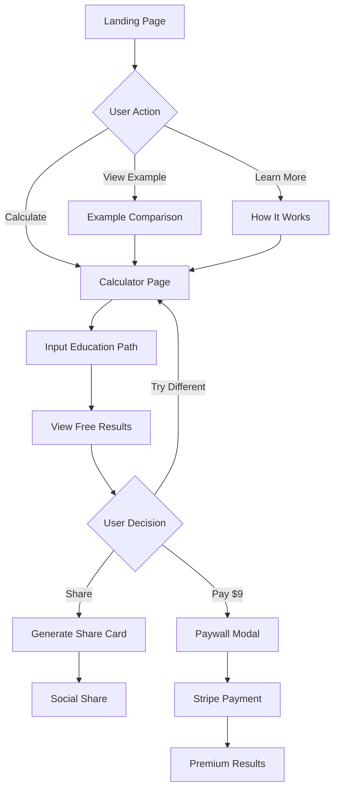

# PathwiseROI - App Flow, Pages & Roles
*Technical User Journey Documentation*

## User Roles

### Current Roles (MVP)
**Visitor** - All users are equal, no authentication required
- Can use calculator
- Can view basic results
- Can share comparisons
- Can purchase detailed reports

### Future Roles (Post-MVP)
- **Registered User** - Email captured, saved calculations
- **Counselor** - B2B access, bulk calculations
- **School Admin** - Institution-wide analytics

---

## Core User Flow



---

## Page Structure

### 1. Landing Page (`/`)

**Purpose:** Convert visitors into calculator users with controversial hook

**URL:** `pathwiseroi.com`

**Components:**
```javascript
<LandingPage>
  <HeroSection>
    <ControversialHeadline />
    <SubheadlineComparison />
    <CTAButton action="startCalculator" />
    <SocialProof count={visitorsToday} />
  </HeroSection>
  
  <ExampleComparisons>
    <ComparisonCard path1="Welding" path2="Law School" />
    <ComparisonCard path1="Nursing" path2="MBA" />
    <ComparisonCard path1="Bootcamp" path2="CS Degree" />
  </ExampleComparisons>
  
  <TrustSection>
    <DataSources />
    <MethodologyTeaser />
    <Disclaimers />
  </TrustSection>
</LandingPage>
```

**Key Elements:**
- Hero headline: 72px, controversial statement
- CTA button: "Find Your Payback Time" (primary, above fold)
- Live counter: "50,234 paths analyzed today"
- 3 shocking comparison examples
- Trust badges and data source logos

**Analytics Events:**
- `page_view`
- `cta_clicked`
- `example_clicked`
- `scroll_depth`

---

### 2. Calculator Page (`/calculate`)

**Purpose:** Gather inputs and show free results

**URL:** `pathwiseroi.com/calculate`

**Components:**
```javascript
<CalculatorPage>
  <CalculatorHeader>
    <ProgressIndicator step={currentStep} />
    <SaveProgressButton /> {/* Future feature */}
  </CalculatorHeader>
  
  <CalculatorForm>
    <PathSelector 
      options={['College', 'Community', 'Trade', 'Bootcamp', 'Work']} 
    />
    <FieldSelector 
      options={dynamicBasedOnPath} 
    />
    <LocationSelector 
      options={['NYC', 'LA', 'Chicago', 'Houston', 'Phoenix', ...]} 
    />
    <TierSelector 
      options={['Premium', 'Standard', 'Budget']} 
    />
    <LivingSituationSelector 
      options={['Home', 'Campus', 'Off-campus']} 
    />
    <AidInput 
      placeholder="Scholarships/aid amount (optional)" 
    />
  </CalculatorForm>
  
  <CalculateButton 
    onClick={calculateROI} 
    loading={isCalculating}
  />
  
  {results && (
    <ResultsSection>
      <FreeResults data={results} />
      <PaywallTeaser />
    </ResultsSection>
  )}
</CalculatorPage>
```

**Input Fields:**

| Field | Type | Options | Required |
|-------|------|---------|----------|
| Path | Dropdown | 5 paths | Yes |
| Field | Dropdown | Dynamic based on path | Yes |
| Location | Dropdown | 10 metros | Yes |
| School Tier | Radio | Premium/Standard/Budget | Yes |
| Living | Radio | Home/Campus/Off-campus | Yes |
| Aid Amount | Number | 0-100000 | No |

**Free Results Display:**
- Breakeven months (large number)
- Basic timeline visualization
- Doubt Score™ with warning
- Share button
- "Unlock Full Analysis" CTA

**Analytics Events:**
- `calculator_started`
- `field_changed_{fieldName}`
- `calculation_completed`
- `results_viewed`
- `share_initiated`
- `paywall_viewed`

---

### 3. Results Page (`/results/[id]`)

**Purpose:** Display shareable results with unique URL

**URL Examples:**
- `pathwiseroi.com/results/abc123`
- `pathwiseroi.com/jake-ucla-vs-welding`

**Components:**
```javascript
<ResultsPage>
  <ResultsHeader>
    <PersonalizedTitle name={userName} />
    <ShareButtons platforms={['Twitter', 'Facebook', 'LinkedIn', 'Copy']} />
  </ResultsHeader>
  
  <MainComparison>
    <BreakevenDisplay months={breakevenMonths} />
    <TimelineVisualization 
      debtPeriod={debtMonths}
      profitPoint={breakevenMonths}
    />
    <DoubtScore score={doubtScore} message={riskMessage} />
  </MainComparison>
  
  <PaywallSection>
    <BlurredContent>
      <TenYearProjection />
      <CashFlowChart />
      <AlternativePaths />
    </BlurredContent>
    <UnlockButton price="$9" />
  </PaywallSection>
  
  <RecalculatePrompt>
    <CTAButton text="Try Different Path" href="/calculate" />
  </RecalculatePrompt>
</ResultsPage>
```

**Share Card Generation:**
- Canvas API creates 1200x630px image
- Includes comparison headline
- Shows breakeven times
- PathwiseROI branding

**URL Structure:**
- Random ID: `/results/[6-char-id]`
- Named comparison: `/[name]-[path1]-vs-[path2]`
- Preserves all calculation parameters in URL

**Analytics Events:**
- `results_page_loaded`
- `share_completed_{platform}`
- `paywall_clicked`
- `recalculate_clicked`

---

### 4. Premium Results Page (`/results/[id]/premium`)

**Purpose:** Display full analysis after payment

**URL:** `pathwiseroi.com/results/abc123/premium`

**Components:**
```javascript
<PremiumResultsPage>
  <PremiumBadge />
  
  <FullAnalysis>
    <TenYearWealth>
      <WealthChart data={projectionData} />
      <KeyMilestones milestones={financialMilestones} />
    </TenYearWealth>
    
    <CashFlowTimeline>
      <MonthlyBreakdown months={120} />
      <DebtPayoffSchedule />
      <IncomeProgression />
    </CashFlowTimeline>
    
    <RiskAnalysis>
      <WhatCouldGoWrong factors={riskFactors} />
      <DropoutRates />
      <UnderemploymentRisk />
    </RiskAnalysis>
    
    <AlternativePaths>
      <PathOption rank={1} savings={dollarAmount} />
      <PathOption rank={2} savings={dollarAmount} />
      <PathOption rank={3} savings={dollarAmount} />
    </AlternativePaths>
  </FullAnalysis>
  
  <DownloadSection>
    <PDFButton onClick={generatePDF} />
    <EmailButton onClick={emailResults} />
  </DownloadSection>
</PremiumResultsPage>
```

**Premium Features:**
- Interactive 10-year wealth chart
- Month-by-month cash flow table
- Risk factor breakdown with percentages
- 3 alternative path recommendations
- PDF generation with full report
- Email results option

**Analytics Events:**
- `premium_page_viewed`
- `chart_interacted_{chartType}`
- `pdf_downloaded`
- `results_emailed`

---

### 5. Payment Flow

**Modal:** Paywall Modal (overlay on results page)

**Payment Process:**
```javascript
<PaywallModal>
  <ModalHeader>
    <CloseButton />
    <TrustBadges />
  </ModalHeader>
  
  <PricingDisplay>
    <Price>$9</Price>
    <Subtitle>One-time payment • No subscription</Subtitle>
  </PricingDisplay>
  
  <FeatureList>
    <Feature icon="chart">10-Year Wealth Projection</Feature>
    <Feature icon="calendar">Month-by-Month Cash Flow</Feature>
    <Feature icon="warning">Hidden Risk Analysis</Feature>
    <Feature icon="alternatives">3 Better Options</Feature>
    <Feature icon="pdf">Professional PDF Report</Feature>
  </FeatureList>
  
  <PaymentButton 
    onClick={redirectToStripe}
    text="Unlock Full Analysis"
  />
  
  <SecurityNote>
    <LockIcon />
    <Text>Secure payment via Stripe</Text>
  </SecurityNote>
</PaywallModal>
```

**Stripe Integration:**
1. User clicks "Unlock"
2. Redirect to Stripe Payment Link
3. Complete payment on Stripe
4. Redirect back with session ID
5. Verify payment server-side
6. Show premium content

**Success URL:** `/results/[id]/premium?session_id=[stripe_session]`  
**Cancel URL:** `/results/[id]?payment=cancelled`

---

### 6. Static Pages

#### How It Works (`/how-it-works`)
```javascript
<HowItWorksPage>
  <MethodologySection>
    <DataSources />
    <CalculationMethod />
    <Assumptions />
    <Limitations />
  </MethodologySection>
  
  <FAQSection>
    <FAQ question="How accurate is this?" />
    <FAQ question="What's included in costs?" />
    <FAQ question="Why these specific paths?" />
  </FAQSection>
  
  <CTASection>
    <Button href="/calculate">Try Calculator</Button>
  </CTASection>
</HowItWorksPage>
```

#### Terms & Privacy (`/terms`, `/privacy`)
- Standard legal pages
- Clear disclaimers about estimates
- No guarantee of income
- Data handling policies

#### 404 Page (`/404`)
```javascript
<NotFoundPage>
  <Headline>This degree doesn't exist (yet)</Headline>
  <Subheadline>But these profitable paths do:</Subheadline>
  <PopularComparisons />
  <CTAButton href="/calculate">Start Over</CTAButton>
</NotFoundPage>
```

---

## State Management

### URL Parameters
All calculator state stored in URL for sharing:
```
/calculate?path=college&field=tech&location=nyc&tier=standard&living=campus&aid=5000
```

### Local Storage
```javascript
{
  recentCalculations: [
    { id: 'abc123', timestamp: Date, path: 'college', field: 'tech', ... }
  ],
  viewedResults: ['abc123', 'def456'],
  purchasedReports: ['abc123'],
  preferences: {
    location: 'nyc',
    currency: 'USD'
  }
}
```

### Session Storage
```javascript
{
  currentCalculation: { /* temporary form data */ },
  analyticsSessionId: 'uuid',
  referrer: 'reddit.com/r/college'
}
```

---

## Navigation Flow

### Primary User Journey
1. **Landing** → See controversial claim
2. **Calculate** → Input education path
3. **Results** → View breakeven time
4. **Share/Pay** → Share or unlock details
5. **Premium** → View full analysis

### Secondary Flows

**Comparison Flow:**
1. Landing → View example
2. Example → Modify inputs
3. Calculate → Get personalized results

**Return User Flow:**
1. Direct to `/calculate` (bookmarked)
2. Pre-filled with last calculation
3. Quick recalculation

**Shared Link Flow:**
1. Click shared link
2. View friend's results
3. "Calculate your own" CTA
4. Redirected to calculator

---

## Error States

### Calculator Errors
```javascript
<ErrorState>
  <Icon type="warning" />
  <Message>Can't calculate that path</Message>
  <Suggestion>Try selecting different options</Suggestion>
  <RetryButton />
</ErrorState>
```

### Payment Errors
```javascript
<PaymentError>
  <Message>Payment failed</Message>
  <Reason>{stripeError.message}</Reason>
  <Actions>
    <RetryButton />
    <SupportLink />
  </Actions>
</PaymentError>
```

### 404 Errors
- Redirect to landing with message
- Suggest popular comparisons
- Clear CTA to start fresh

---

## Mobile Considerations

### Touch Targets
- Minimum 44x44px for all interactive elements
- 8px spacing between buttons
- Larger CTAs on mobile (full width)

### Mobile-Specific UI
```javascript
// Desktop: Side-by-side
<Desktop>
  <CalculatorForm /> | <Results />
</Desktop>

// Mobile: Stacked
<Mobile>
  <CalculatorForm />
  <Results />
</Mobile>
```

### Responsive Breakpoints
- Mobile: < 768px
- Tablet: 768px - 1024px
- Desktop: > 1024px

---

## Analytics Implementation

### Page-Level Tracking
Every page tracks:
- Page view
- Time on page
- Scroll depth
- Exit rate
- Referrer source

### Event Tracking Matrix

| User Action | Event Name | Properties |
|------------|------------|-----------|
| Start calculation | `calculator_started` | `source`, `device` |
| Change field | `field_changed` | `field_name`, `value` |
| Complete calc | `calculation_completed` | `all_inputs`, `result` |
| View paywall | `paywall_viewed` | `breakeven_months` |
| Click pay | `payment_initiated` | `price`, `result_id` |
| Complete payment | `payment_completed` | `amount`, `result_id` |
| Share result | `result_shared` | `platform`, `result_id` |
| Download PDF | `pdf_downloaded` | `result_id` |

### Conversion Funnel
```
Landing (100%)
  ↓
Calculator Started (40%)
  ↓
Calculation Completed (30%)
  ↓
Results Viewed (30%)
  ↓
Paywall Viewed (10%)
  ↓
Payment Completed (2%)
```

Target: >2% visitor to payment conversion

---

## Performance Requirements

### Page Load Times
- Landing: < 2 seconds
- Calculator: < 1.5 seconds
- Results: < 1 second
- Payment: < 2 seconds

### Interactive Times
- Time to Interactive: < 3 seconds
- First Contentful Paint: < 1 second
- Largest Contentful Paint: < 2.5 seconds

### API Response Times
- Calculation: < 200ms (client-side)
- Share generation: < 500ms
- Payment verification: < 1 second

---

*This flow prioritizes conversion through controversy and social proof. Every page should push users toward calculation and sharing.*
